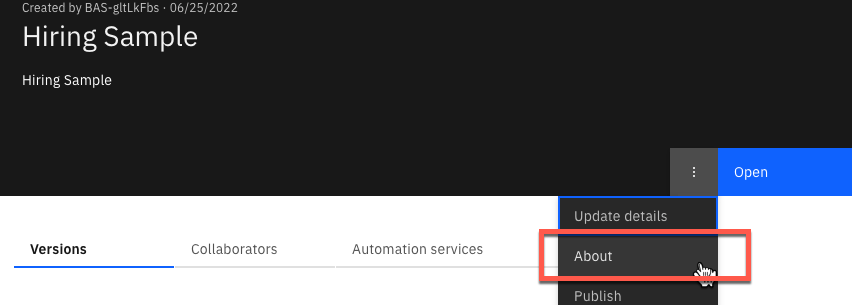
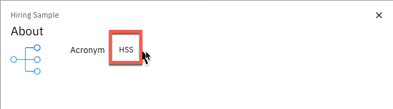
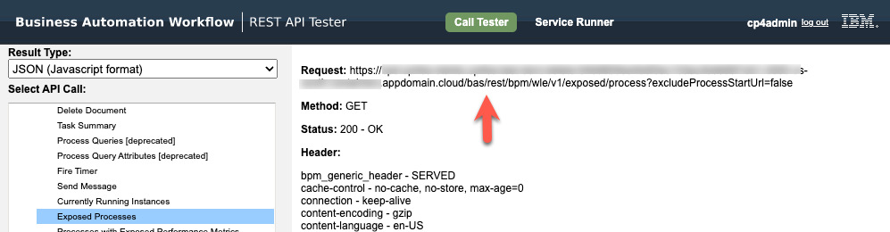

# GRUMP : BAW Extraction Utility
A simple utility that uses the BAW REST API's to extract instance data and export it as a CSV.

# Pre-Reqs
Just a recent version of python3, I'm using Python 3.10.

# Install
The easiest way is to download and unpack the zip file.
I do recommend you create a new python virtual environment. If you don't already have virtualenv installed : 

`pip3 install virtualenv`

Then create a virtual environment, here mine is called grumpy :

`virtualenv grumpy --python=python3.10`

Then activate the new environment : 

`source grumpy/bin/activate`

From the command line where app.py has been extracted just execute the following commands
to install the needed libraries into your new virtual environment.

`pip3 install -r requirements.txt `

Then run the following command :

`python3 grump.py -c config.yaml`


# Demonstration
There is an example of me doing this in a video here : 
[Grump Video](https://youtu.be/YZXIsKJIy58)

# Configuration
A sample is provided The project acronym is needed to find process instances. In the latest versions of BAW this is found in the "About" window, as shown below.
Here we are using the Hiring Sample Process App



The acronym for the process app is HSS



Here is sample of config to search this process app & process
```
user: myuserID
password: somePassword
root-url: https://url-to-my.baw-server.appdomain.cloud/bas/

project-acronym: HSS
process-name: Standard HR Open New Position
thread-count: 1

# Optional config
instance-limit: 50
modified-after : 
modified-before : 

business-data:
   - name: date
     path: $..*.requisition.reqNum
```

To find the root-url of your server open the Rest API test utility and execute one of the commands. Here I've just
run IBM Business Automation Workflow REST API's: Process API: Exposed Processes. The complete URL is shown :



The root-url used by Grump is everything before the word `rest` as shown by the red arrow.